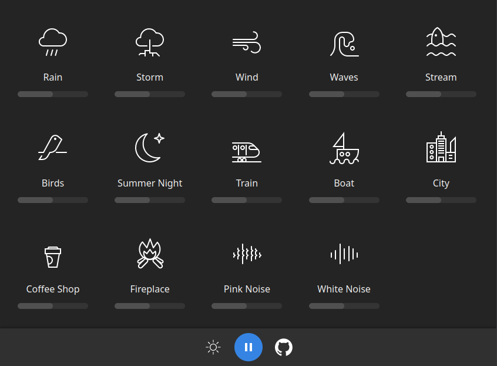

# BlanketJS

**Listen to different sounds**

 

  

## Description

Improve focus and increase your productivity by listening to different sounds. Or allows you to fall asleep in a noisy environment.

This is a port of [Blanket](https://github.com/rafaelmardojai/blanket) in plain JavaScript.

## Credits

Ported by me, [Leonhard Tissen](https://github.com/LeonhardTissen).

Originally developed by **[Rafael Mardojai CM](https://github.com/rafaelmardojai)** and [contributors](https://github.com/rafaelmardojai/blanket/graphs/contributors).

Name idea by Jorge Toledo.

For detailed information about sounds licensing, [check this file](https://github.com/rafaelmardojai/blanket/blob/master/SOUNDS_LICENSING.md).
